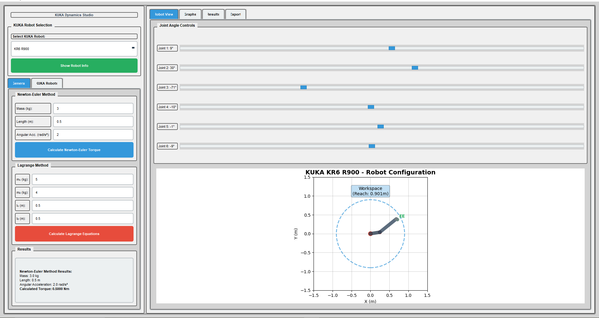
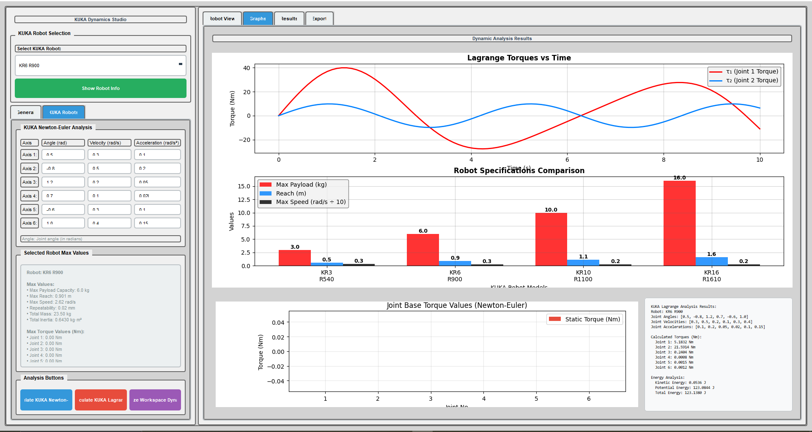
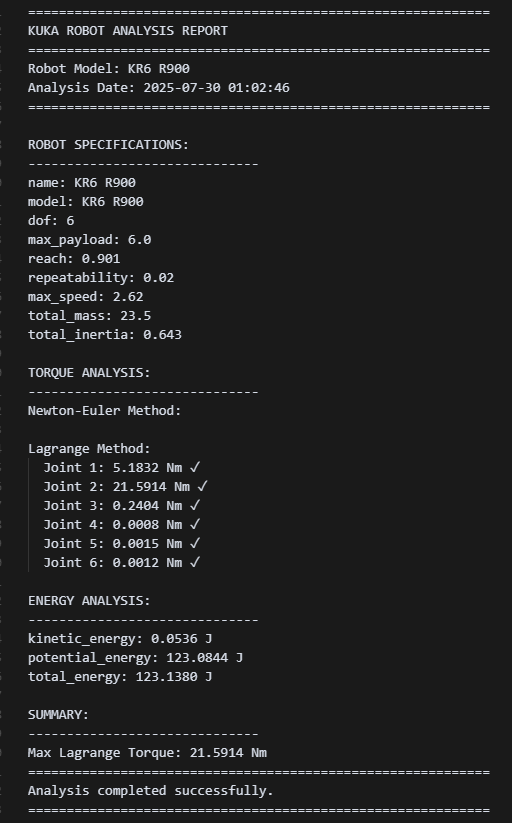

# KUKA Dynamics Studio

A comprehensive desktop application for analyzing KUKA robot dynamics using Newton-Euler and Lagrange methods. This tool provides real-time torque calculations, workspace analysis, and visualization capabilities for industrial robotics.

## Features

###  Robot Analysis
- **Multi-Method Analysis**: Newton-Euler and Lagrange dynamics calculations
- **KUKA Robot Support**: Pre-configured models (KR3 R540, KR6 R900, KR10 R1100, KR16 R1610)
- **Real-time Calculations**: Instant torque and energy analysis
- **Safety Monitoring**: Automatic torque limit checking and warnings

###  Visualization & Results
- **Dynamic Graphs**: Real-time plotting of torque vs time
- **Robot Specifications**: Comparative analysis of robot parameters
- **Workspace Analysis**: Complete workspace dynamics evaluation
- **Export Capabilities**: Results export in JSON, CSV, and TXT formats

###  User Interface
- **Intuitive Design**: Siemens SIMATIC HMI-inspired interface
- **Axis-by-Axis Input**: Individual parameter entry for each joint
- **Real-time Feedback**: Immediate calculation results and warnings
- **Multi-tab Layout**: Organized sections for different analysis types

### Main Interface View

*Intuitive multi-tab UI with real-time joint input and method selection*

### Torque Analysis (Newton-Euler)

*Real-time torque vs. time plot generated using Newton-Euler method*

### Analysis Report Output


*Automatically generated joint-wise torque, energy and dynamic parameter summary as a formatted analysis report.*

## Installation

### Prerequisites
- Python 3.7 or higher
- PyQt5
- NumPy
- Matplotlib

### Setup
1. Clone the repository:
```bash
git clone <https://github.com/MEK-0/KUKA-Dynamics-Analysis.git>
cd KUKA-Dynamics-Studio
```

2. Install required dependencies:
```bash
pip install -r requirements.txt
```

3. Run the application:
```bash
python main.py
```

## Usage

### Getting Started
1. **Select a Robot**: Choose from available KUKA models in the dropdown
2. **Configure Parameters**: Enter joint angles, velocities, and accelerations
3. **Run Analysis**: Click calculation buttons to perform dynamics analysis
4. **View Results**: Check graphs and text results in the tabs

### Analysis Methods

#### Newton-Euler Method
- Calculates joint torques using Newton-Euler formulation
- Considers inertia, gravitational, and centrifugal effects
- Provides real-time torque calculations for each joint

#### Lagrange Method
- Uses Lagrangian mechanics for dynamics analysis
- Calculates kinetic and potential energy
- Provides comprehensive energy analysis

#### Workspace Analysis
- Evaluates robot performance across entire workspace
- Generates torque profiles for different configurations
- Identifies optimal operating regions

### Input Parameters

#### Joint Parameters
- **Angle (rad)**: Joint angle in radians (0-360°)
- **Velocity (rad/s)**: Angular velocity of each joint
- **Acceleration (rad/s²)**: Angular acceleration of each joint

#### Robot Specifications
- **Max Payload**: Maximum weight the robot can carry
- **Reach**: Maximum distance the robot can extend
- **Max Speed**: Maximum angular velocity
- **Repeatability**: Position accuracy

## Project Structure

```
KUKA-Dynamics-Studio/
├── main.py                 # Application entry point
├── requirements.txt        # Python dependencies
├── README.md              # This file
├── graphics/              # Visualization modules
│   ├── plotter.py         # Graph plotting functionality
│   └── robot_visualizer.py # Robot 3D visualization
├── logic/                 # Dynamics calculation modules
│   ├── newton_euler.py    # Newton-Euler method implementation
│   ├── lagrange.py        # Lagrange method implementation
│   └── inertia.py         # Inertia calculations
├── robots/                # Robot definitions and dynamics
│   ├── kuka_robots.py     # KUKA robot configurations
│   └── kuka_dynamics.py   # KUKA-specific dynamics
├── ui/                    # User interface modules
│   └── main_window.py     # Main application window
└── utils/                 # Utility functions
    └── export_utils.py    # Data export functionality
```

## Supported Robot Models

| Model | Max Payload | Reach | Max Speed | Applications |
|-------|-------------|-------|-----------|--------------|
| KR3 R540 | 3 kg | 0.541 m | 3.14 rad/s | Light assembly, pick & place |
| KR6 R900 | 6 kg | 0.901 m | 2.62 rad/s | Medium payload handling |
| KR10 R1100 | 10 kg | 1.101 m | 2.44 rad/s | Heavy payload operations |
| KR16 R1610 | 16 kg | 1.61 m | 2.18 rad/s | Heavy industrial applications |

## Features in Detail

### Real-time Analysis
- Instant calculation of joint torques
- Energy analysis (kinetic and potential)
- Safety limit monitoring
- Real-time graph updates

### Export Functionality
- **JSON Export**: Structured data export
- **CSV Export**: Tabular data format
- **TXT Export**: Human-readable text format

### Safety Features
- Automatic torque limit checking
- Warning messages for exceeded limits
- Safety recommendations
- Performance monitoring

## Technical Specifications

### Calculation Methods
- **Newton-Euler**: Forward-backward recursive algorithm
- **Lagrange**: Energy-based formulation
- **Workspace Analysis**: Multi-point evaluation

### Visualization
- **Matplotlib Integration**: Professional plotting
- **Real-time Updates**: Dynamic graph refresh
- **Multi-panel Layout**: Organized data presentation

### Performance
- **Optimized Calculations**: Efficient numerical methods
- **Memory Management**: Efficient data handling
- **Responsive UI**: Smooth user interaction

